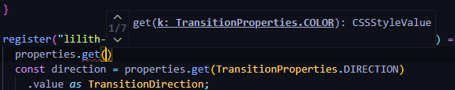

# LILITH-PAINTER

---

### WHAT

LILITH-PAINTER is an easy tool for Paint API (Houdini APIs).

Use this module to easy register paint and worklet with typescript.


### WHY

When I ready to try Paint API with typescript, something is holding me back – Houdini APIs missing type definitions.

I'm searching type definitions on `google`, `stack-overflow`, `github`and `npmjs` but never result. So I thought, why don't I write something to help myself?

So, It's LILITH-PAINTER, declare Houdini APIs' type (in file `src/houdini.d.ts`) but not all, just a part of I will need. If you want other, welcome to complete the part that you need, thank you very much!

*Ah, If anybody know where I can found the type definitions, say to me please.*


### HOW TO USE?

#### FOR USER

1. Install LILITH-PAINTER:

   ```sh
   npm install lilith-painter
   ```

2. Use typescript, like this:

   ```typescript
   import { register, IsStyleValue } from "lilith-painter";
   
   register(
     "lilith-transition", 
     {
       name: "--lilith-transition-color",
       inherits: true,
       syntax: "<color>",
       initialValue: "#000",
       ...IsStyleValue,
     },
     (ctx, geom, properties) => {
       // draw something...
     });
   ```
   
   And you can get this:




And other example in folder `example/` or see this repository: [LILITH-TRANSITION](https://github.com/juergenie/lilith-transition).

#### FOR DEVELOPER

1. fork this repository

2. clone your fork to local

3. run:

   `cd lilith-transition`

   `yarn`

   `yarn dev`

   open web page: `http://127.0.0.1:4000`

4. build:

   `yarn build`

5. create a merge request, from your branch to this repository's preview branch and notify me with [mail](mailto://juergenie@qq.com), thanks 😀.

##### DEVELOPER TIPS

- use project's default lint.
- use kebab-case when you create file or style-class.
- use snake_case when you create function or variable or parameter.
